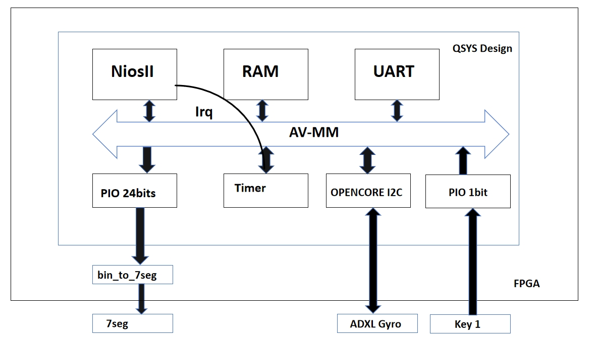
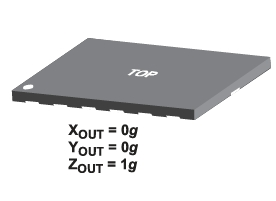
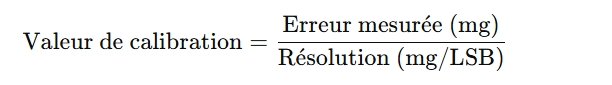
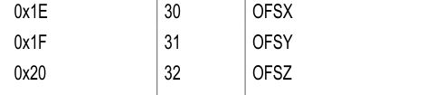
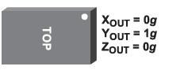
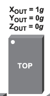
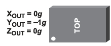
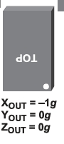

# <strong>Afficher les données du gyroscope de la carte de développement DE10-Lite.</strong>

## <strong>a. Introduction</strong>
Dans ce projet, nous allons construire un système plus complexe basé sur les deux expériences précédentes. La partie principale du système est l'accéléromètre. En nous appuyant sur les interruptions et l'affichage sur les écrans à sept segments étudiés auparavant, cette fois-ci, nous communiquerons avec l'accéléromètre via I2C. Les valeurs d'accélération collectées seront affichées sur les écrans à sept segments, et le bouton Key1 permettra de basculer entre les valeurs d'accélération des axes X, Y et Z.

---

## <strong>b. Architecture du système</strong>

### <strong>1. QSYS</strong>

  
  
<em><strong>Figure 1 : QSYS</strong></em>

Comme illustré, par rapport aux deux projets précédents, nous avons ajouté un cœur IP OpenCores I2C pour collecter les données du capteur d'accélération. Les données d'accélération collectées par le processeur softcore sont transmises via un port PIO de 24 bits et, finalement, affichées sur les écrans à sept segments. 

Lors de la création de Qsys, il est important de noter que la broche d'horloge du capteur (**GSENSOR_SCLK**) et la broche de données (**GSENSOR_SDI**) doivent être respectivement connectées aux broches SCL et SDA du cœur IP OpenCores I2C. De plus :

- **Broche GSENSOR_CS_n** : doit être réglée à 1 pour désactiver le mode SPI (car nous avons choisi soit SPI soit I2C).  
- **Broche GSENSOR_SDO** : utilisée pour sélectionner une adresse alternative, doit être réglée à 1 pour conserver l'adresse I2C par défaut du capteur.

---

### <strong>2. Lire les données des axes X, Y et Z, et les afficher sur les écrans à sept segments.</strong>
Le capteur d'accélération transmet les données brutes d'accélération des axes X, Y et Z via l'interface I2C. Pour chaque axe, nous disposons de deux registres, l'un pour stocker le LSB (8bits) et l'autre pour stocker le MLB (8bits).

1. Tout d'abord, nous assemblons ces deux éléments de données pour former un élément de données de 16 bits.  
2. Ensuite, la valeur non signée est remplacée par une valeur signée. Parce que nous pouvons voir qu'il y a des nombres négatifs pour l'accélération.  
3. Les valeurs brutes sont ensuite converties en milli-g.  
4. Enfin, le résultat est décomposé et transmis à un tube numérique à sept segments. En ce qui concerne le signe négatif, nous le définissons dans le code VHDL.

---

### <strong>3. Calibrage des données</strong>
À la fin de l'expérience, nous constaterons qu'il y a une certaine erreur entre les données et ce que nous voulons. Nous devons donc calibrer les données. Pour calibrer le capteur d'accélération ADXL345, nous utilisons les registres de décalage (0x1E, 0x1F, 0x20) pour ajuster les valeurs mesurées des axes X, Y et Z comme suit :

  

#### **3.1. Valeurs d'accélération mesurées**  
Le capteur étant posé sur un plan horizontal, ma méthode a consisté à effectuer 10 lectures des valeurs d'accélération sur chacun des trois axes, X, Y et Z, et à calculer la moyenne pour chacun d'entre eux.

#### **3.2. erreur de calcul**  
- Comme indiqué, les valeurs idéales pour les axes X et Y sont **0 mg** et la valeur idéale pour l'axe Z est **1g (environ 1000 mg).**。  
- L'erreur est obtenue en comparant la valeur mesurée à la valeur idéale. Par exemple, la valeur moyenne de la mesure de l'axe X est de **15,9 mg**, l'erreur est donc de **15,9 mg**. Il en va de même pour les autres axes Y et Z.

#### **3.3. Calcul des valeurs d'étalonnage**  
Selon la fiche technique de l'ADXL345, la résolution du registre de décalage est de **15,6 mg/LSB**. La valeur d'étalonnage est calculée par la formule :

  

Nous pouvons donc calculer que la valeur d'étalonnage est approximativement égale à 1.

#### **3.4. Écrire dans le registre de décalage**  
Écrivez les valeurs d'étalonnage dans les registres correspondants respectivement :  
- Axe X : 0x1E 
- Axe Y : 0x1F 
- Axe Z : 0x20

  

#### **3.5. Étalonnage terminé**  
Après étalonnage, les données affichées sur le tube numérique doivent être proches de 0 mg pour les axes X et Y et proches de 1000 mg pour l'axe Z.

---

## <strong>c. Progrès et résultats</strong>
**Dans ce projet, j'ai réalisé toutes les fonctions. Utilisez la touche 0 pour réinitialiser la valeur et utilisez la touche 1 pour changer les axes X, Y et Z. Chaque fois que nous changeons, nous pouvons voir le résultat correspondant dans le tube numérique.
Dans cette démonstration, j'ai vérifié toutes les directions et constaté que les valeurs dans les images suivantes et les valeurs dans la vidéo correspondent.**

1. **Test1**  

  
  
<em><strong>Figure 1 : Test1</strong></em>

https://github.com/user-attachments/assets/06e4fadf-635e-496a-8aa4-3ab4370b736a

2. **Test2**  

  
  
<em><strong>Figure 2 : Test2</strong></em>

https://github.com/user-attachments/assets/bad673e0-7576-4e69-8a17-2c8402679e59

3. **Test3**  

  
  
<em><strong>Figure 3 : Test3</strong></em>

https://github.com/user-attachments/assets/0c28a4d6-6ca6-4243-bf87-a99b36072bb9

4. **Test4**  

  
  
<em><strong>Figure 4 : Test4</strong></em>

https://github.com/user-attachments/assets/85d1014f-1713-497e-9727-0bb6631dbbd4

5. **Test5**  

  
  
<em><strong>Figure 5 : Test5</strong></em>

https://github.com/user-attachments/assets/a25cb5e4-a9df-416e-a9a9-c1fad2584d91

---

## <strong>d.Conclusion</strong>
Nous pouvons voir que l'affichage du tube numérique et le traitement des interruptions de cette expérience ont été abordés dans nos expériences précédentes. Cependant, la difficulté de ce projet réside dans la manière d'appeler correctement l'OpenCore fourni pour implémenter le processus de lecture et d'écriture requis par le manuel de la puce. Bien sûr, dans cette expérience, j'ai également appris à établir une communication I2C, à transmettre les données X, Y et Z dans chaque direction et à les convertir. Une autre chose est l’étalonnage des données.
